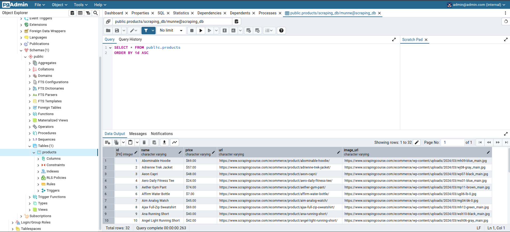

# Scraping Website 

## Project Overview
The project is designed to scrape property information from  https://www.scrapingcourse.com/ecommerce/ and store it in a **PostgreSQL** database using **SQLAlchemy**. The goal of this project is to implement a scrapy pipeline to clean and store scrapped data into the database.

## Table of Contents

- [Features](#features)
- [Project Structure](#project-structure)
- [Getting Started](#getting-started)

## Features
### Scraping Data
It scraps data form this website https://www.scrapingcourse.com/ecommerce/. It scrapes name of the product, product url, product image url and price.


### Storing Data in Postgres database using SqlAlchemy
Product data is stored in the database

### View data in pgAdmin
You can view stored scraped data through pgadmin


## Project Structure

The project follows a standard Scrapy project structure. Here’s an overview:


```plaintext
ecommerce/
├── docker-compose.yml
├── Dockerfile
├── requirements.txt
└── ecommerce/
    ├── __init__.py
    ├── items.py
    ├── middlewares.py
    ├── pipelines.py
    ├── settings.py
    └── spiders/
        ├── __init__.py
        └── scraper.py
```
- **ecommerce/spiders/scraper.py:** Contains the Scrapy spider that scrapes product information.

- **ecommerce/items.py:** Defines an SQLAlchemy model for product database, with fields for product details, and includes a function to create the database engine and session for interacting with it.

- **scrapingcourse_scraper/pipelines.py:** Defines a Scrapy pipeline that processes scraped products and saves data to a PostgreSQL database using SQLAlchemy.

- **settings.py:** Configures Scrapy settings, including database connection and other spider settings.

- **Dockerfile:** Defines the Docker container for the scraper.

- **docker-compose.yml:** Configures Docker containers for the Scrapy scraper, PostgreSQL database and pgAdmin.

## Getting Started

### Prerequisites

Before running this project, ensure you have the following installed:

- **Python 3x** (for local development)
- **Git** (for version control)
- **Docker and Docker Compose**
   - Follow the official Docker installation guide to install Docker on your system: [Docker Installation Guide](https://docs.docker.com/desktop/)


### Installation

If you installed my scrapy project before in your computer, you have to remove its container, volumes and images from your computer. Then, follow the below instructions for installing this project.
1. Clone the repository

   ```bash
   git clone https://github.com/Khairun-Nahar-Munne/scrapy-project.git
   cd scrapy-project
   ```
2. Set Up a Virtual Environment

   On Linux/macOS:

    ```bash
    python3 -m venv env  # or python -m venv env 
    source env/bin/activate
    ```
   On Windows:

    ```bash
    python3 -m venv env   # or python -m venv venv 
    env\Scripts\activate
    ```
3. Install depedencies

    ```bash
    cd ecommerce
    pip install -r requirements.txt
    ```

### Running Application
- Ensure Docker Desktop is running on your system, as it is required to manage the containers. Then, execute the following commands to build and run the application in therminal (scrapy-project/ecommerce$) :

   ```bash 
    docker-compose build
    docker-compose up
   ```
   
 - If you face any issue during building docker, you can stop the docker container (press `Ctrl + C`), run docker container down command and again up the docker container for running.
   ```bash
    docker-compose down
    docker-compose up
   ```

### Viewing Database Tables in the Docker Container
You can view database in two ways through terminal pgAdmin. You have to keep the docker-container running to view database.

- To view data from pgAdmin:
   
   1. Set Up pgAdmin
   

      ```
      - Launch pgAdmin on http://localhost:5050 in your browser.

      - Provide Admin Email: admin@admin.com and Password: admin123

      - Right-click on "Servers" > Click on "Register" > "Server" > Fill up the details > Save.

      - Fill up the details:

         General Tab:
         Name your connection: ScrapDB

         Connection Tab:
         Host: postgres
         Port: 5432 
         Maintenance Database: postgres.
         Username: munne
         Password: munne123

      ```
   2. Click on Server > ScrapDB > scraping_db> Schemas > Tables > products
   3. Right click on hotles > View/Edit Data> All Rows.

   This will display all the records stored in the `products` table.

   


- To inspect the database tables from terminal and view their data within the PostgreSQL container, follow these steps:

   1. Access the PostgreSQL Container
      Run the following command to open a bash shell inside the running database container:
      
      ```bash
      docker exec -it postgresDB_container bash
      ```
   2. Connect to the PostgreSQL Database
      ```bash
      psql -U munne -d scraping_db
      \c scraping_db
      ```
   3. Query the Database
   To view the data in the `products` table, execute the following SQL command:

      ```bash
      SELECT * FROM public.products;
      ```
      This will display all the records stored in the `products` table.
 
## Presentation Slide
https://docs.google.com/presentation/d/1EZdLkeTevUCu08Q3ASB-9g9JrrAGPggGKUpKcQZ_-OM/edit?usp=sharing